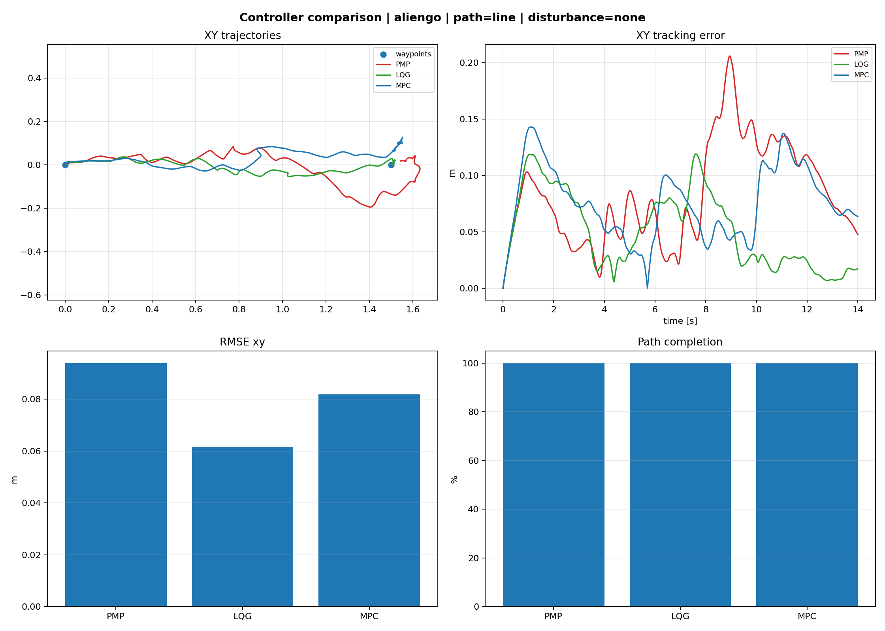
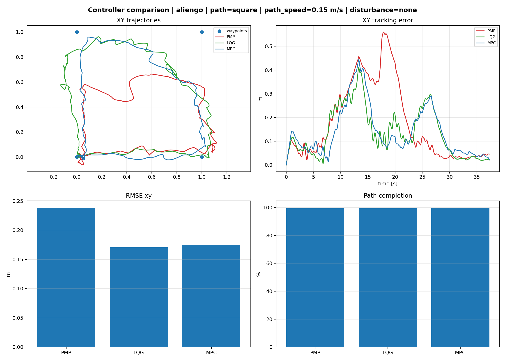
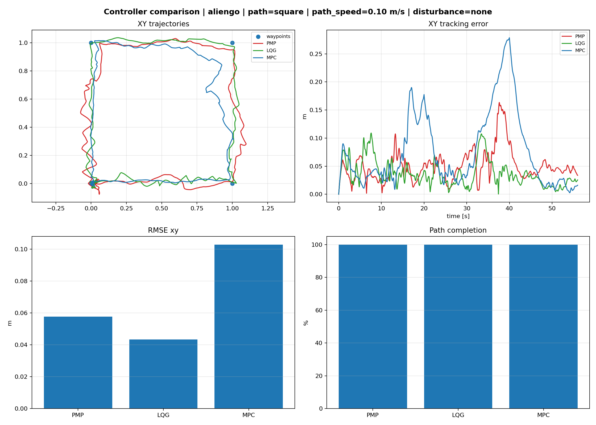
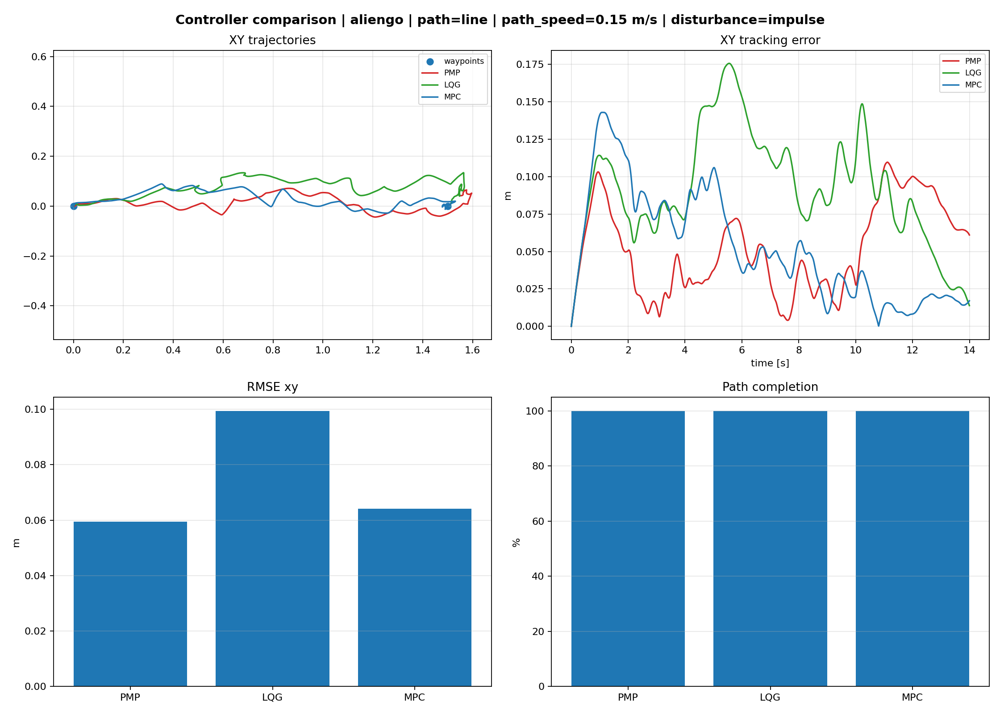
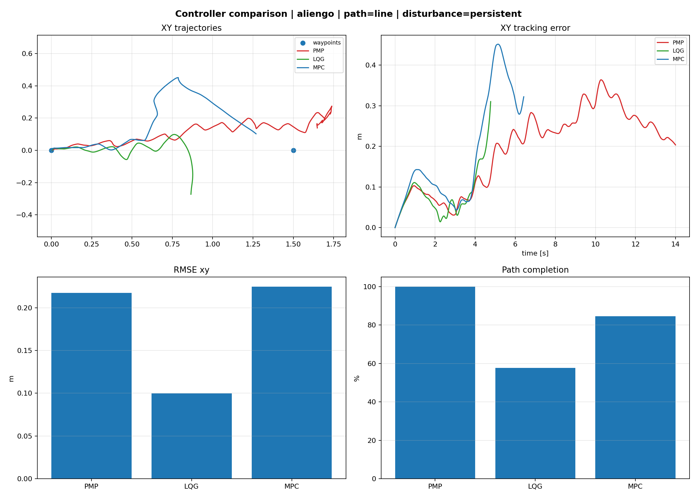

# Quadruped Optimal Control: PMP, LQG & MPC

## Integrantes
Emiliano Niño García | A00228130  
Oscar de la Rosa López | A00838666  
Rigoberto Said Soto Quiroga | A01571662  
Arturo Balboa Alvarado | A01712275  
Angel Hernández Rojas | A00836889

# Metodología

## Base de simulación
Este proyecto se desarrolló utilizando el repositorio **Quadruped-PyMPC** como framework base de simulación y control para robots cuadrúpedos en MuJoCo.

Se utilizó específicamente el robot:

- **AlienGo** (`--robot-name aliengo`)

sobre el entorno:

- Flat terrain en MuJoCo
- Simulación dinámica con `sim_dt = 0.002 s`
- Frecuencia de control ≈ 100 Hz

---

## Integración de controladores
Se integraron tres controladores proporcionados originalmente en el curso:

- **PMP** (Pontryagin Minimum Principle)
- **LQG** (Linear Quadratic Gaussian)
- **MPC** (Model Predictive Control)

Estos controladores fueron conectados a la librería `Quadruped-PyMPC`, utilizando la dinámica del robot y el wrapper:

```python
QuadrupedPyMPC_Wrapper(...)
```

permitiendo traducir las fuerzas calculadas por los controladores en torques articulares aplicados al robot AlienGo.

---

## Cambios realizados sobre el ejemplo original del profesor

### 1. De regulación a tracking por waypoints
El ejemplo original estaba enfocado en estabilización.

Nosotros añadimos:

- generación de trayectorias por waypoints:
  - line
  - square
  - zigzag

```bash
--path line
--path square
--path zigzag
```

usando:

```python
WaypointTrajectory(...)
waypoint_follower(...)
```

para que el robot no solo se estabilizara sino siguiera trayectorias.

---

### 2. Integración con locomoción real del PyMPC
En lugar de mover únicamente el centro de masa, se acopló el alto nivel (PMP/LQG/MPC) con el generador de marcha de Quadruped-PyMPC:

- gait trot
- footstep planning
- swing trajectories
- ground reaction forces
- torque computation

Esto permitió locomoción real del cuadrúpedo.

---

### 3. Modificación de parámetros del gait
Se ajustaron parámetros del robot:

- `step_freq`
- `duty_factor`
- `step_height`
- impedance gains
- swing feedback gains

para mejorar estabilidad antes de aumentar velocidad.

---

### 4. Corrección por fuerzas de reacción (GRF feedback)
Se agregó retroalimentación usando:

```python
controller_velocity_correction(...)
```

para corregir:

- velocidad longitudinal
- velocidad lateral
- yaw rate

a partir de las fuerzas de reacción calculadas.

---

### 5. Comparación automática entre controladores
Se añadió modo comparación:

```bash
--controller all
```

que ejecuta:

- PMP
- LQG
- MPC

y genera:

- plots comparativos
- métricas automáticas
- CSV de resultados

```bash
results/metrics_runs.csv
results/comparison_*.csv
```

---

## Métricas evaluadas
Se evaluó desempeño con:

- Tracking RMSE
- Error al waypoint final
- Porcentaje de trayectoria completada
- Survival time
- Error de velocidad
- Distancia recorrida
- Norma de fuerzas GRF

Esto permitió comparar cuantitativamente los tres controladores.

---

## Perturbaciones
También se probaron perturbaciones externas:

```bash
--disturbance impulse
--disturbance persistent
```

para analizar robustez ante empujes y disturbios sostenidos.

---

## Comandos de ejecución

Ejemplo LQG:

```bash
python examples/run_mujoco.py \
--controller lqg \
--robot-name aliengo \
--path line \
--duration 10
```

Comparación completa + disturbance:

```bash
python examples/run_mujoco.py \
--controller all \
--robot-name aliengo \
--path square \
--disturbance impulse
--path-speed 0.08
```
Extras

Si no se especifica duración la simulación durara hasta que el robot termine todo el recorrido.
Si no se especifica la velocidad en el que recorre el path se usa 0.15 m/s por preterminado.
Si MujoCo esta dando problemas es mejor evitar el render y que simule todo.

```bash
--no-render
```
## Resultados
Las graficas que se generan al correr el codigo se guardan en el folder de results, se pueden hacer pruebas individuales o poner el comando de **--controller all** para tener una comparativa de la efectividad de los 3 controladores, para la discución de resultados y determinar efectividad se tomara en cuenta lo que se menciono anteriormente en la sección de **Metricas evaluadas**

Además de la graficas, al correr nuestro run_mujoco.py genera un summary final de los datos mencionados anteriormente.

### Primera Prueba: Rutas sin perturbaciones
**Linea recta sin perturbaciones**


Como es esperado, en un entorno controlado y una ruta simple no es problema para los 3 controladores y los 3 muestran ser capaces de por lo menos terminar la ruta preestablecida. Sin embargo, las gráficas nos demuestran que el controlador LQG fue el que tuvo menos errores durante su trayecto. A continuación esta el output con los datos numericos.

```bash
  --- PMP Summary ---
  Tracking RMSE xy:     0.0939 m
  Tracking RMSE xyz:    0.1003 m
  Mean velocity error:  0.1181 m/s
  Final waypoint error: 0.0475 m
  Path completion:      100.0 %
  Survival time:        14.00 s
  Mean GRF norm:        135.3 N
  Termination:          completed

  --- LQG Summary ---
  Tracking RMSE xy:     0.0615 m
  Tracking RMSE xyz:    0.0741 m
  Mean velocity error:  0.0814 m/s
  Final waypoint error: 0.0172 m
  Path completion:      100.0 %
  Survival time:        14.00 s
  Mean GRF norm:        53.7 N
  Termination:          completed

--- MPC Summary ---
  Tracking RMSE xy:     0.0819 m
  Tracking RMSE xyz:    0.0904 m
  Mean velocity error:  0.0790 m/s
  Final waypoint error: 0.0637 m
  Path completion:      100.0 %
  Survival time:        14.00 s
  Mean GRF norm:        29.1 N
  Termination:          completed
```

**Cuadrado sin perturbaciones 1**


**Cuadrado sin perturbaciones 2**


La velocidad del recorrido afecta fuertemente en el control y despempeño del robot, se puede ver claramente como en comparacion de Cuadrado 1,2 y 3 es que una baja velocidad genera mejores resultados y podra seguir los waypoints de mejor manera ya que no sentira la necesidad de cortar camino con tal de mantener ese path speed.

### Segunda Prueba: Ruta de linea con perturbaciones
**Linea con perturbacion de impulso**

**Linea con perturbacion persistente**


### Tercera Prueba: Ruta Cuadrado con perturbaciones


## Conclusiones
